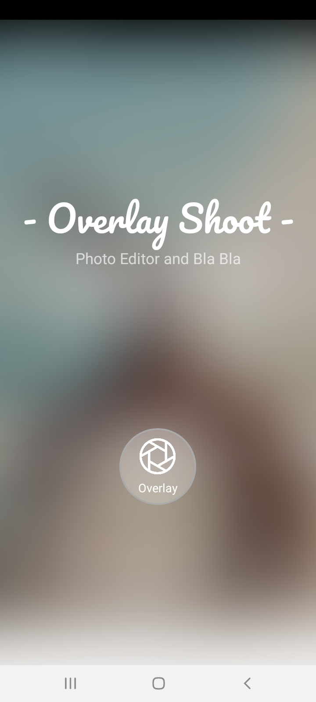
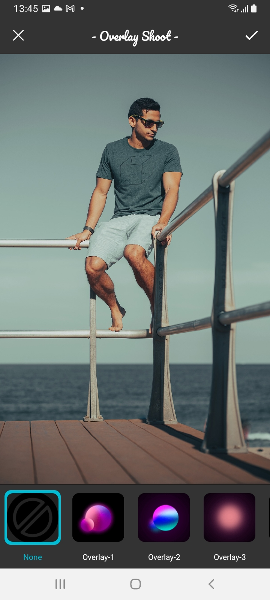
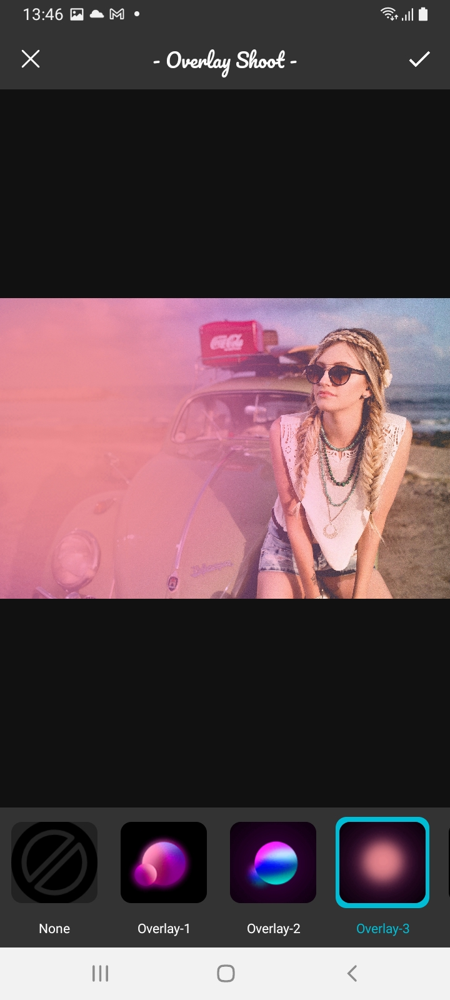
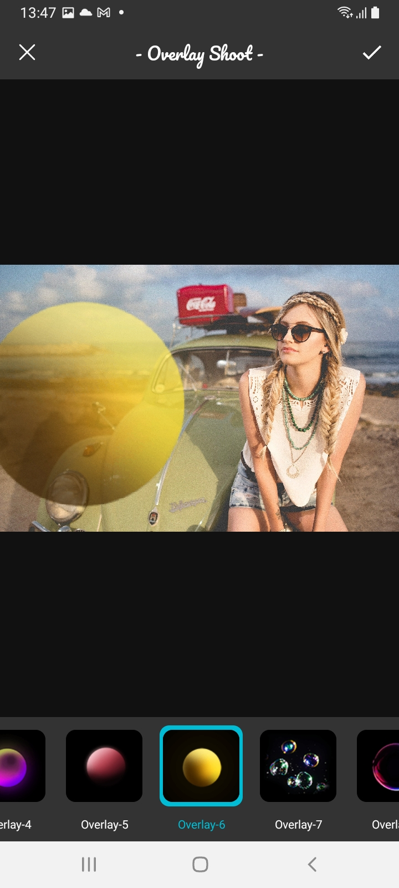
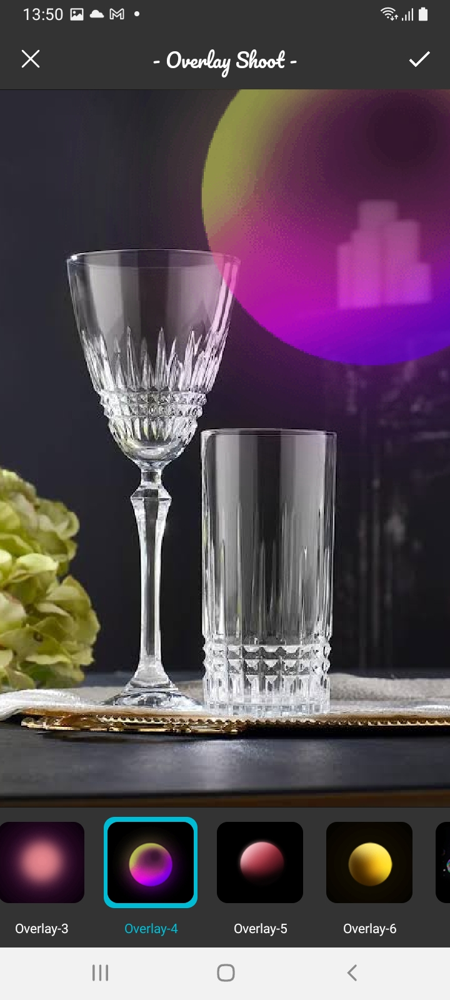
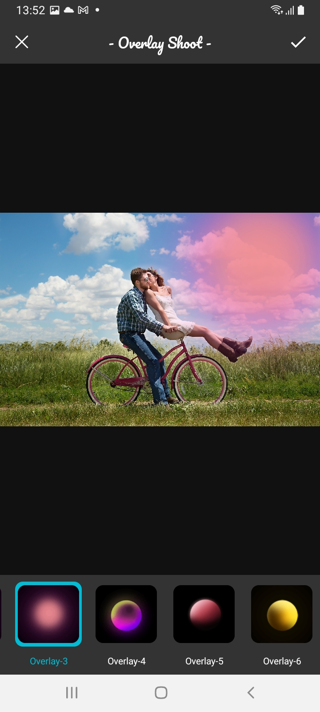
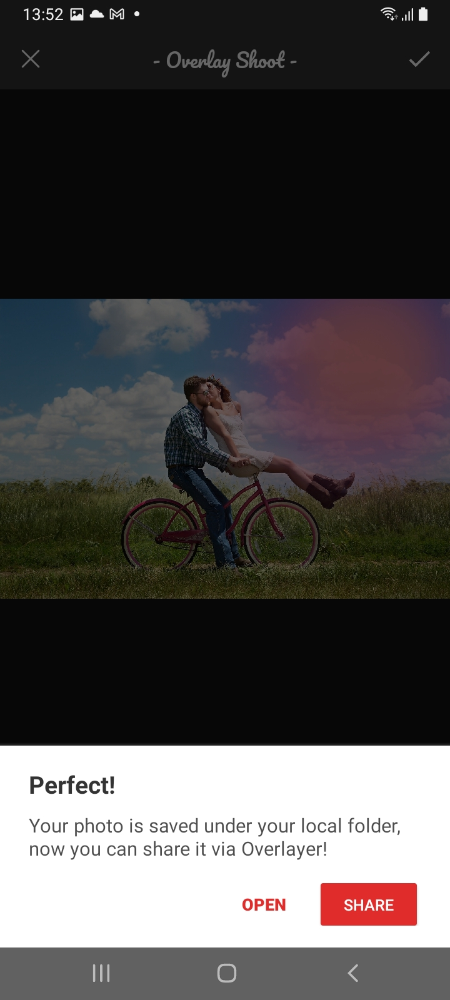

# Overlayer
Thanks to this application, you can add and edit beautiful effects on your photos.

## Why this project exists
This project arose from the idea of turning a small part of freelance project I did a long time ago into a library. With TinderLike Cards library, you can easily have a tinder-style design. Since the project was written in the past, it may have problems. I will continue to improve the library with your help. Please be sure to report any issues you find. I took the structure of listview as an example for myself. You can easily include it in your project with the use of a simple adapter.

## Features
- [x] Kotlin
- [x] Stylish Design
- [x] RxJava
- [x] Customization
- [x] CrashSafe
- [x] Canvas, Matrix
- [x] MVP
- [x] Pinch-Zoom and Drag via gestures
- [x] Room with smart blob workers
- [x] Application Variants

## Previews
  
  
  
  